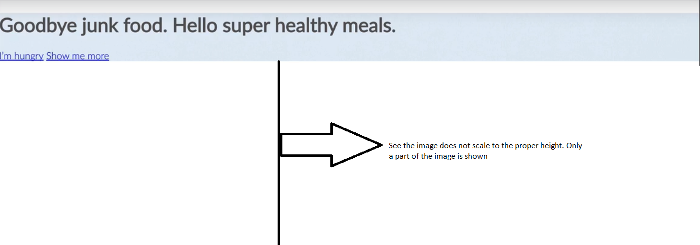

## Including normalize.css

Normalize.css makes browsers render all elements more consistently and in line with modern standards. Include this file before adding any css file

```
<link rel="stylesheet" type="text/css" href="normalize.css">
```

---


## Fluid Grid

We will be using fluid grid to develop our website. The fluid grid that we would be using is 

http://www.responsivegridsystem.com/

Inlcude the above grid.css after normalize.css

```
<link rel="stylesheet" type="text/css" href="grid.css">
```

Note: The downloaded file will have seperate file as 2cols.css, 3cols.css. Combine everything into one and rename it as grid.css and include it here

Using this grid all our content will be in columns. You can have from 1 column in a row to 12 columns in a row.

When using this grid we will be using only one value in px and rest we would be using in percentages

```
 .row{
 	max-width: 1140px;
 	margin-left: auto;
 	margin-right: auto;
 }

```

---

## Elements in HTML


  ```
  <article>        
     <aside>                       
     <details>                   
     <figcaption>                 
     <figure>                     
     <footer>                     
     <header>                     
     <main>                       
     <mark>                       
     <nav>                       
     <section>                    
     <summary>                    
     <time>
   
   ```   
---

## Building the header part

  ### Final output:

  We will be creating the below output.

  * Placing image in the header section
  * Placing main text on the image
  * Placing 2 buttons on the image
  * Placing navigation on the image 

  ### Result:
  
  
  
  ### STEP 1: ```<header>``` tag

 We will put everything inside ```<header>``` DIV

```
<header> 

</header>
```


### STEP 2: Container

 Now we will create a container inside the ```<header>``` tag

```
<header>

  <div class="hero-text-box">
  	
  </div>

</header>
```

### STEP 3: H1 tag

 Now we will put ```<h1>``` inside the container

```
<header>
	
	<div class="hero-text-box">
       
          <h1>Goodbye junk food. Hello super healthy meals.</h1>
 
	</div>

</header>
```

### STEP 4: BUTTONS

 Now we need two buttons inside the container. For buttons we will use ```<a href>``` tag

```
 <header>	
   <div class="hero-text-box">       
       <h1>Goodbye junk food. Hello super healthy meals.</h1>
       <a href="#">I'm hungry</a> 
       <a href="#">Show me more</a>
   </div>

</header>
```

Result: 

  

### STEP 5: Add default styles

  * Add *{}, html{} default for all CSS

```
 * {
    margin: 0;
    padding: 0;
    box-sizing: border-box;
 }
``` 

```
 html {
 	background-color: #fff;
 	color: #555;
	font-family: 'Lato', 'Arial', sans-serif;
	font-weight: 300;
	font-size: 20px;
	text-rendering: optimizeLegibility;  //using this is a good practise
 }
```

### STEP 6: background-image

```
header{
	background-image: url(hero.jpg);
}
```

### STEP 7: Image Height

When you set a background image the image only fills the part which has some content like shown below



To scale the image to whole view port

```
header{
	background-image: url(hero.jpg);
	height: 100vh; //means 100% of the view port
}
```

Now the image would have scaled like this


### STEP 8: image background-size

Even now if you see the image would be like zoomed in and part of the image will not be visible. See the image below


So resolve this we will have to give background-size

```
header{
	background-image: url(hero.jpg);
	background-size:cover;
	height: 100vh; //means 100% of the view port
}
```
### STEP 9: background-centered

Then you will have to make background centered

```
header{
	background-image: url(hero.jpg);
	background-size:cover;
	background-position: center;
	height: 100vh; //means 100% of the view port
}

```

Now the image will look like this


So now even if you resize the browser window the whole image would scale down and be properly shown in the screen.
