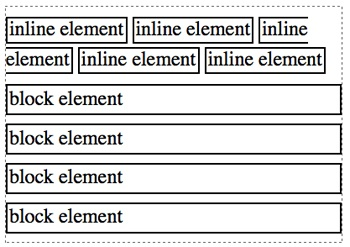
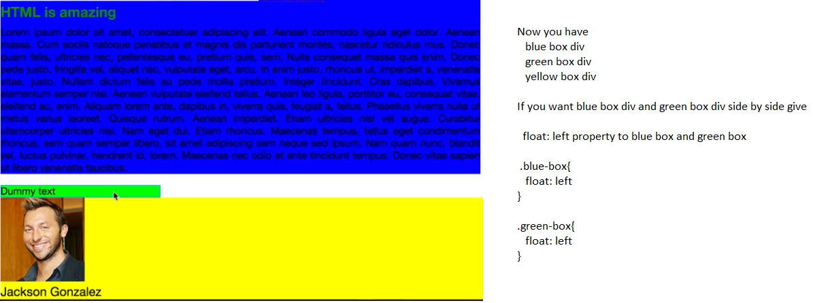

### Remove default margins 

All browsers set default margins for HTML elements if we dont specify any. To remove the default margins use the below code

```
* {
    margin: 0;
    padding: 0;
    box-sizing: border-box;
}
```

### What is box sizing?


---

## Block Elements and Inline Elements

In HTML there are block elements and inline elements

```
<h1> and <p> tags are examples of block elements. 

 <a href>, <strong> and <em> are examples of inline elements. 

```

You cannot set height and width for inline elements.

Block elements are stacked vertically one after another.

Inline elements are stacked vertically one aside another. 



---

###  Using the container.

Put all the elements inside a container and set the container like this

Steps:

   
   2. Make the container centered 

```
.container {
  Step 1: Set width of the container
   width: 1140px;
  Step 2: Make the DIV centered. auto means that the left and right margin are adjusted automatically according to the context of the           element which is the browser window. So if you adjust the browser window the content stays centered.
   margin-left: auto;  
   margin-right: auto;
}
```


---

### Understanding the float and clearfix property




```
  .clearfix:after {
   content: "",
   display: table;
   clear: both;
}

```

---


